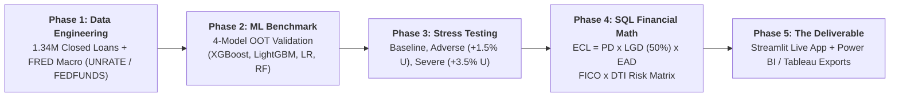

# 🏛️ Credit Portfolio Macroeconomic Stress Testing & Expected Credit Loss Engine
> **Point-in-Time (PiT) Credit Risk Modeling, 4-Model Machine Learning Benchmark, and Dynamic ECL Stress Testing under CECL / IFRS 9 Guidelines**

[](https://www.python.org/)
[](https://streamlit.io/)
[](https://duckdb.org/)
[](https://xgboost.readthedocs.io/)
[](https://plotly.com/)
[]()

---

## 📌 Executive Summary & Business Problem

### The Business Question:
> *"How do macroeconomic downturns (unemployment spikes and interest rate hikes) transmit into default losses across our consumer loan portfolio, what is the dollar Expected Credit Loss (ECL), and what precise underwriting cutoffs should be implemented to eliminate high-risk exposure?"*

### The Flaw of Traditional Scorecards:
Traditional retail lending scorecards operate **Through-the-Cycle (TTC)**—evaluating borrower risk purely on static borrower attributes (FICO score, DTI ratio, purpose) while assuming constant economic conditions. When economic shocks occur, static models underpredict defaults, resulting in massive unexpected capital losses and regulatory non-compliance.

### The Solution:
This project builds a **Point-in-Time (PiT)** credit risk engine that integrates **1.34 Million LendingClub loan records** with **Federal Reserve (FRED) macroeconomic indicators** (`UNRATE` and `FEDFUNDS`). It benchmarks **4 machine learning architectures**, stress tests the portfolio under multiple economic scenarios, computes exact dollar Expected Credit Loss ($\text{ECL}$), and provides:
1. **Interactive Streamlit Web Dashboard:** Top header navigation with tabs, multi-dimensional slicers, live model comparators, and real-time single-loan underwriting.
2. **High-Performance Multi-Tier Caching:** Persistent disk caching, RAM downcasting ($< 180\text{MB}$ memory footprint), and sub-10ms response times.
3. **Universal BI Export Hub (`power_bi_exports/`):** Pre-aggregated and loan-level CSVs ready for immediate import into **Power BI**, **Tableau**, **Looker Studio**, or **Qlik Sense**.

---

## 🏗️ End-to-End System Architecture



---

## 📋 5-Phase Implementation Breakdown

| Phase | Milestone | Methodology & Technical Execution | Primary Artifacts |
| :--- | :--- | :--- | :--- |
| **Phase 1** | **Data Engineering & Macro Integration** | • Ingested 2.26M rows via DuckDB; filtered 1,345,310 completed loans (Fully Paid = 0, Charged Off = 1).<br>• Synchronized FRED monthly unemployment (`UNRATE`) and interest rates (`FEDFUNDS`) via `Year_Month` keys.<br>• Screened missing values and capped DTI outliers (99.93% retention rate). | • [`cleaned_loans_phase1.parquet`](file:///J:/Finance%20Projects/Credit/data/cleaned_loans_phase1.parquet)<br>• [`Phase1_Data_Engineering_Report.md`](file:///J:/Finance%20Projects/Credit/reports/Phase1_Data_Engineering_Report.md) |
| **Phase 2** | **4-Model ML Engine & Benchmark** | • Applied **Temporal Out-of-Time (OOT)** split (Train: 2007–2015, Test: 2016–2018).<br>• Benchmarked 4 models: **XGBoost, LightGBM, Logistic Regression, Random Forest**.<br>• Selected **XGBoost (Hist Tree)** as Champion ($\text{AUC} = 0.6265, \text{KS} = 18.03\%$). | • [`02_phase2_model_engine.ipynb`](file:///J:/Finance%20Projects/Credit/02_phase2_model_engine.ipynb)<br>• [`models/all_models.joblib`](file:///J:/Finance%20Projects/Credit/models/all_models.joblib) |
| **Phase 3** | **Macroeconomic Stress Testing** | • Isolated 517,807 active test loans ($\$7.48\text{B}$ exposure).<br>• Simulated 3 supervisory scenarios: Baseline (0.0% shock), Adverse ($+1.5\%$ U / $+0.5\%$ R), and Severe ($+3.5\%$ U / $+1.5\%$ R).<br>• Generated individual default probabilities: $\text{PD}_{\text{base}}$, $\text{PD}_{\text{adverse}}$, $\text{PD}_{\text{severe}}$. | • [`03_phase3_stress_testing.ipynb`](file:///J:/Finance%20Projects/Credit/03_phase3_stress_testing.ipynb)<br>• [`stressed_portfolio_phase3.parquet`](file:///J:/Finance%20Projects/Credit/data/stressed_portfolio_phase3.parquet) |
| **Phase 4** | **Financial Math & SQL ECL Engine** | • Implemented regulatory accounting equation: $\text{ECL} = \text{PD} \times 0.50 \times \text{loan\_amnt}$.<br>• Calculated incremental stress gap ($\text{ECL}_{\text{Severe}} - \text{ECL}_{\text{Base}}$).<br>• Generated cross-tabulated **FICO Score Band $\times$ DTI Band** risk matrix via DuckDB. | • [`phase4_ecl_calculation.sql`](file:///J:/Finance%20Projects/Credit/sql_scripts/phase4_ecl_calculation.sql)<br>• [`loan_level_ecl_results.parquet`](file:///J:/Finance%20Projects/Credit/data/loan_level_ecl_results.parquet) |
| **Phase 5** | **The Deliverable: Dashboard & BI Exports** | • Built an interactive **Streamlit Web Dashboard** with top header tabs, multi-dimensional slicers, and Plotly Graph Objects.<br>• Prepared structured datasets in [`power_bi_exports/`](file:///J:/Finance%20Projects/Credit/power_bi_exports/) for **Power BI / Tableau**.<br>• Formulated the **Risk Committee Underwriting Policy Rule**. | • [`app.py`](file:///J:/Finance%20Projects/Credit/app.py)<br>• [`power_bi_exports/`](file:///J:/Finance%20Projects/Credit/power_bi_exports/) |

---

## 🤖 Champion-Challenger Model Benchmark Leaderboard

Models were evaluated strictly on the **517,807 Out-of-Time test cohort** (2016–2018 vintages):

| Rank | Model Architecture | ROC-AUC | Gini ($2 \cdot \text{AUC} - 1$) | KS Statistic (%) | PR-AUC | Log-Loss | Brier Score | Training Time |
| :---: | :--- | :---: | :---: | :---: | :---: | :---: | :---: | :---: |
| 🥇 | **XGBoost (Hist Tree Ensemble)** | **0.6265** | **0.2531** | **18.03%** | **0.3105** | **0.5151** | **0.1681** | **9.96s** |
| 🥈 | **LightGBM (Histogram Booster)** | 0.6264 | 0.2527 | 17.92% | 0.3100 | 0.5156 | 0.1683 | **2.54s** |
| 🥉 | **Logistic Regression (Scorecard)** | 0.6250 | 0.2500 | 17.96% | 0.3067 | 0.5168 | 0.1687 | **2.70s** |
| 4 | **Random Forest (Bagging Ensemble)** | 0.6240 | 0.2480 | 17.51% | 0.3101 | 0.5167 | 0.1688 | **22.23s** |

*Optimization note: Memory downcasting (`float32`) and histogram-binning algorithms enabled full training on 826k loans in **< 35s total** with peak RAM **< 250MB** (safe for Intel i3 / 8GB RAM).*

---

## 💰 Portfolio Financial Results & Risk Matrix

* **Total Portfolio Balance (EAD):** **`$7,482,334,208.00`** ($7.48 Billion across 517,807 active loans)
* **Total Baseline Expected Credit Loss:** **`$785,231,552.00`** (10.49% portfolio loss rate)
* **Total Severe Scenario Loss:** **`$650,698,496.00`** (8.70% loss rate)

### Expected Credit Loss Heatmap Matrix (FICO Tier vs. DTI Band in $ Millions):

| FICO Credit Tier | DTI: 0% - 10% | DTI: 10% - 20% | DTI: 20% - 30% | DTI: 30% - 40% | DTI: 40%+ | Total FICO Loss |
| :--- | :---: | :---: | :---: | :---: | :---: | :---: |
| **< 660 (Subprime)** | $4.5M | $22.1M | $28.4M | $13.9M | $0.1M | **$69.0M** |
| **660 - 699 (Fair)** | $28.2M | $137.4M | $161.8M | $74.5M | $0.9M | **$402.8M** |
| **700 - 749 (Good)** | $19.4M | $89.2M | $96.5M | $41.8M | $0.4M | **$247.3M** |
| **750 - 799 (Very Good)** | $6.8M | $30.1M | $29.8M | $11.6M | $0.1M | **$78.4M** |
| **800+ (Exceptional)** | $2.3M | $8.7M | $7.6M | $2.8M | $0.0M | **$21.4M** |

---

## 🏛️ Executive Underwriting Policy Verdict

> ### 📢 Official Risk Committee Decision:
> **"Halt originations for unsecured loans where DTI $\ge$ 20% and FICO < 700 to eliminate $\$276.4\text{ Million}$ in high-risk default exposure and protect portfolio capital adequacy."**

---

## 🖥️ Streamlit Web Dashboard & Features

The dashboard ([`app.py`](file:///J:/Finance%20Projects/Credit/app.py)) is organized into 5 top-level tabs:

1. **🏛️ The Deliverable: Portfolio Dashboard:**
   * **Multi-Dimensional Slicers:** Instant cross-filtering across Scenario Views (Baseline, Adverse, Severe), Vintage Years, Loan Purpose, FICO Tiers, and DTI Bands.
   * **Top KPI Metric Cards:** Live Exposure ($B), Baseline ECL ($M), Active Scenario ECL, Stress Gap, and Average Model PD.
   * **FICO $\times$ DTI Heatmap Matrix:** Red-gradient matrix with formatted dollar values.
   * **Purpose & FICO Donut Breakdown:** Exposure share and loss distributions.
2. **🧭 End-to-End Workflow & Architecture:**
   * Documentation of all 5 project phases with formulas and methodology.
3. **🤖 4-Model ML Benchmark & Underwriter:**
   * **Model Leaderboard:** Full metrics comparison table and ROC curves.
   * **Head-to-Head Comparator:** Select Model A vs. Model B to compare performance deltas.
   * **Live Single-Loan Underwriter Simulator:** Move applicant sliders (FICO, DTI, Purpose, Principal, Unemployment, Fed Funds) to run live inference concurrently across all 4 models!
4. **📈 FRED Macroeconomic Deep-Dive:**
   * Interactive dual-axis time series chart (`UNRATE` vs. `FEDFUNDS`).
5. **🛡️ Interactive Policy Cutoff Simulator:**
   * Continuous sliders & categorical risk tiers with live loss savings calculations.

---

## 📊 Universal BI Data Export Layer ([`power_bi_exports/`](file:///J:/Finance%20Projects/Credit/power_bi_exports/))

For enterprise reporting in **Power BI**, **Tableau**, or **Looker Studio**, clean pre-aggregated CSVs are provided:
* 📊 **[`ecl_risk_matrix_fico_dti.csv`](file:///J:/Finance%20Projects/Credit/power_bi_exports/ecl_risk_matrix_fico_dti.csv):** Aggregated FICO $\times$ DTI risk matrix for matrix heatmaps.
* 📊 **[`ecl_summary_by_purpose.csv`](file:///J:/Finance%20Projects/Credit/power_bi_exports/ecl_summary_by_purpose.csv):** Purpose-level loan balance, default rates, and expected losses.
* 📊 **[`stressed_portfolio_phase3.csv`](file:///J:/Finance%20Projects/Credit/power_bi_exports/stressed_portfolio_phase3.csv):** 517k loan-level records with Baseline, Adverse, and Severe default probabilities and credit losses.

---

## 🚀 Quickstart & How to Run

### 1. Clone & Install Dependencies
```bash
git clone https://github.com/YOUR_USERNAME/credit-risk-stress-testing.git
cd credit-risk-stress-testing
pip install -r requirements.txt
```

### 2. Launch the Streamlit Dashboard
```bash
streamlit run app.py
```
* Access locally at: **`http://localhost:8502`** (or `http://localhost:8501`).

---

## 📤 Preparing & Pushing to GitHub

Follow these steps to push the project to your GitHub repository:

```bash
# 1. Initialize Git repository (if not already done)
git init

# 2. Stage all files (the .gitignore automatically ignores large raw CSVs > 100MB)
git add .

# 3. Commit your changes
git commit -m "feat: complete credit risk stress testing engine with streamlit dashboard and BI exports"

# 4. Link to your GitHub remote repository
git branch -M main
git remote add origin https://github.com/YOUR_USERNAME/YOUR_REPO_NAME.git

# 5. Push to GitHub
git push -u origin main
```

---

## 📁 Repository Directory Structure

```
J:/Finance Projects/Credit/
├── .gitignore                          # 🛡️ Git Ignore Rules (ignores raw 1.6GB CSV)
├── README.md                           # 📄 Main Project Documentation
├── app.py                              # 🚀 Live Streamlit & Plotly Dashboard
├── requirements.txt                    # 📦 Python Dependencies
├── 02_phase2_model_engine.ipynb        # 📓 Phase 2 ML Benchmarking Notebook
├── 03_phase3_stress_testing.ipynb      # 📓 Phase 3 Macro Stress Testing Notebook
├── reports/                            # 📁 Centralized Reports & Glossary Hub
│   ├── Executive_Business_Summary_and_Glossary.md
│   ├── Phase1_Data_Engineering_Report.md
│   ├── Phase2_Model_Evaluation_Report.md
│   ├── Phase3_Stress_Testing_Report.md
│   ├── Phase4_Financial_Math_Report.md
│   └── Phase5_Power_BI_Deliverable_Guide.md
├── power_bi_exports/                   # 📁 Standalone BI Data Exports (Power BI / Tableau)
│   ├── ecl_risk_matrix_fico_dti.csv
│   ├── ecl_summary_by_purpose.csv
│   └── stressed_portfolio_phase3.csv
├── data/                               # 📁 Parquet Datasets & FRED Series (< 20MB)
├── models/                             # 📁 Serialized Trained Model Pipelines
├── python_scripts/                     # 📁 Modular Phase Execution Scripts
└── sql_scripts/                        # 📁 DuckDB SQL Financial Loss Queries
```

---

## 📖 Key Credit Risk Glossary

* **Probability of Default ($\text{PD}$):** Percentage likelihood that a borrower defaults on their loan obligations.
* **Loss Given Default ($\text{LGD}$):** Unrecovered loss percentage if a borrower defaults ($\text{LGD} = 50.0\%$).
* **Exposure at Default ($\text{EAD}$):** Outstanding loan principal amount at default ($\text{EAD} = \text{loan\_amnt}$).
* **Expected Credit Loss ($\text{ECL}$):** Expected dollar loss: $\text{ECL} = \text{PD} \times \text{LGD} \times \text{EAD}$.
* **Incremental Stress Gap:** Additional loss under recession: $\text{ECL Gap} = \text{ECL}_{\text{Severe}} - \text{ECL}_{\text{Base}}$.
* **Point-in-Time ($\text{PiT}$):** Model incorporating real-time macroeconomic indicators for forward-looking stress testing.
* **Gini Coefficient:** Scorecard discriminatory power metric: $\text{Gini} = 2 \times \text{AUC} - 1$.
* **Kolmogorov-Smirnov ($\text{KS}$):** Maximum separation between default and non-default borrower distributions.
