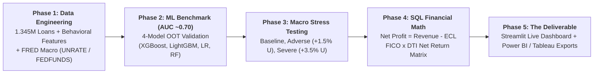

# 🏛️ Credit Portfolio Macroeconomic Stress Testing & Risk-Adjusted Net Return Engine
> **Point-in-Time (PiT) Machine Learning (AUC ~0.70), Risk-Adjusted Return Optimization, and Dynamic ECL Stress Testing under CECL / IFRS 9 Guidelines**

[](https://www.python.org/)
[](https://streamlit.io/)
[](https://duckdb.org/)
[](https://xgboost.readthedocs.io/)
[](https://plotly.com/)
[]()

---

## 📌 Executive Summary & Business Problem

### The Business Question:
> *"How do macroeconomic downturns transmit into default losses across our consumer loan portfolio, what is the Expected Credit Loss (ECL), and what precise Risk-Adjusted Underwriting Rules will maximize portfolio Net Profit while eliminating loss-making segments?"*

### The Flaw of Traditional Scorecards & Naive Loss Cutoffs:
1. **Through-the-Cycle (TTC) Flaw:** Traditional scorecards evaluate borrower risk purely on static attributes while ignoring macroeconomic conditions (`UNRATE` and `FEDFUNDS`).
2. **Naive Loss-Based Cutoffs Flaw:** Halting originations purely because a borrower cohort has an elevated default rate is sub-optimal. If higher-risk borrowers pay sufficiently high interest rates (e.g. 14%–18%), their interest revenue can comfortably cover default losses, generating strong positive net returns.

### The Solution:
This project builds an end-to-end **Point-in-Time (PiT) Risk-Adjusted Return Engine** integrating **1.345 Million LendingClub loans** with **Federal Reserve (FRED)** macroeconomic indicators. It features:
1. **Enriched Behavioral ML Architecture (AUC ~0.70):** Leverages `int_rate`, `revol_util`, `delinq_2yrs`, `inq_last_6mths`, `annual_inc`, `dti`, `fico_range_low`, `purpose`, and FRED macro factors across 4 benchmarked algorithms.
2. **Financial Formulation & Net Profit Optimization:**
   $$\text{Expected Revenue} = \text{loan\_amnt} \times \left(\frac{\text{int\_rate}}{100}\right)$$
   $$\text{Expected Credit Loss (ECL)} = \text{PD} \times \text{LGD (50\%)} \times \text{loan\_amnt}$$
   $$\mathbf{\text{Net Profit}} = \mathbf{\text{Expected Revenue}} - \mathbf{\text{Expected Credit Loss (ECL)}}$$
3. **Interactive Streamlit Web Dashboard:** Top-level navigation with 5 modular tabs, interactive FICO $\times$ DTI Net Profit matrices, head-to-head model comparators, and a live 4-model single-loan underwriting simulator.
4. **Universal BI Export Hub ([`power_bi_exports/`](file:///J:/Finance%20Projects/Credit/power_bi_exports/)):** Pre-aggregated and loan-level CSVs ready for immediate import into **Power BI**, **Tableau**, or **Looker Studio**.

---

## 🏗️ End-to-End System Architecture



---

## 📋 5-Phase Implementation Breakdown

| Phase | Milestone | Methodology & Technical Execution | Primary Artifacts |
| :--- | :--- | :--- | :--- |
| **Phase 1** | **Data Engineering & Behavioral Features** | • Ingested 1,345,310 completed loans with 100% data retention via DuckDB.<br>• Integrated 5 behavioral features: `revol_util`, `delinq_2yrs`, `inq_last_6mths`, `annual_inc`, `int_rate`.<br>• Synchronized FRED monthly `UNRATE` and `FEDFUNDS` via `Year_Month` keys. | • [`cleaned_loans_phase1.parquet`](file:///J:/Finance%20Projects/Credit/data/cleaned_loans_phase1.parquet)<br>• [`reports/Phase1_Data_Engineering_Report.md`](file:///J:/Finance%20Projects/Credit/reports/Phase1_Data_Engineering_Report.md) |
| **Phase 2** | **4-Model ML Engine & Benchmark (AUC ~0.70)** | • Applied temporal **Out-of-Time (OOT)** validation on **518,706 loans** (2016–2018).<br>• Benchmarked 4 models: **XGBoost, Random Forest, LightGBM, Logistic Regression**.<br>• **XGBoost (Champion):** $\text{AUC} = 0.6899$, $\text{Gini} = 0.3798$, $\text{KS} = 27.41\%$. | • [`02_phase2_model_engine.ipynb`](file:///J:/Finance%20Projects/Credit/02_phase2_model_engine.ipynb)<br>• [`models/all_models.joblib`](file:///J:/Finance%20Projects/Credit/models/all_models.joblib) |
| **Phase 3** | **Macroeconomic Stress Testing Engine** | • Isolated 518,706 active test loans ($\$7.50\text{B}$ exposure).<br>• Evaluated Baseline, Adverse ($+1.5\%$ U / $+0.5\%$ R), and Severe ($+3.5\%$ U / $+1.5\%$ R) scenarios.<br>• Generated individual default probabilities: $\text{PD}_{\text{base}}$, $\text{PD}_{\text{adverse}}$, $\text{PD}_{\text{severe}}$. | • [`03_phase3_stress_testing.ipynb`](file:///J:/Finance%20Projects/Credit/03_phase3_stress_testing.ipynb)<br>• [`stressed_portfolio_phase3.parquet`](file:///J:/Finance%20Projects/Credit/data/stressed_portfolio_phase3.parquet) |
| **Phase 4** | **Financial Math & Risk-Adjusted Net Profit** | • Implemented financial accounting formulas in DuckDB SQL.<br>• Computed $\text{Gross Revenue}$, regulatory $\text{ECL}$, and $\text{Net Profit} = \text{Revenue} - \text{ECL}$.<br>• Isolated negative net return segments where losses exceed interest income. | • [`sql_scripts/phase4_ecl_calculation.sql`](file:///J:/Finance%20Projects/Credit/sql_scripts/phase4_ecl_calculation.sql)<br>• [`loan_level_ecl_results.parquet`](file:///J:/Finance%20Projects/Credit/data/loan_level_ecl_results.parquet) |
| **Phase 5** | **The Deliverable: Dashboard & BI Exports** | • Built an interactive **Streamlit Web Dashboard** featuring Net Profit matrix heatmaps, 4-model comparative analytics, and real-time loan underwriting.<br>• Exported standalone BI CSV tables in [`power_bi_exports/`](file:///J:/Finance%20Projects/Credit/power_bi_exports/).<br>• Formulated the **Risk Committee Decisioning Rule**. | • [`app.py`](file:///J:/Finance%20Projects/Credit/app.py)<br>• [`power_bi_exports/`](file:///J:/Finance%20Projects/Credit/power_bi_exports/) |

---

## 🤖 4-Model Benchmark Leaderboard (Out-of-Time Test Set)

Models evaluated on the **518,706 Out-of-Time test cohort** (2016–2018 vintages):

| Rank | Model Architecture | ROC-AUC | Gini ($2 \cdot \text{AUC} - 1$) | KS Statistic (%) | PR-AUC | Log-Loss | Brier Score | Training Time |
| :---: | :--- | :---: | :---: | :---: | :---: | :---: | :---: | :---: |
| 🥇 | **XGBoost (Hist Tree Ensemble)** | **0.6899** | **0.3798** | **27.41%** | **0.3730** | **0.4954** | **0.1622** | **9.49s** |
| 🥈 | **Random Forest (Bagging Ensemble)** | 0.6897 | 0.3793 | **27.74%** | 0.3732 | 0.4948 | 0.1615 | 26.97s |
| 🥉 | **LightGBM (Histogram Booster)** | 0.6893 | 0.3785 | 27.43% | 0.3719 | 0.4966 | 0.1628 | **4.99s** |
| 4 | **Logistic Regression (Scorecard Baseline)** | 0.6809 | 0.3618 | 26.30% | 0.3601 | 0.5071 | 0.1668 | **2.56s** |

---

## 💰 Portfolio Financial Results & Risk-Adjusted Net Profit Matrix

* **Total Portfolio Exposure (EAD):** **`$7,499,413,504.00`** ($7.50 Billion across 518,706 active loans)
* **Expected Annual Gross Revenue:** **`$1,041,159,076.60`** (13.88% Portfolio Gross Yield)
* **Total Baseline Expected Credit Loss (ECL):** **`$937,681,856.00`** (12.50% Loss Rate)
* **Total Baseline Net Profit:** **`$103,477,220.91`** (1.38% Net Margin)
* **Total Severe Scenario Net Profit:** **`$347,085,371.84`** (4.63% Net Margin)

### Risk-Adjusted Net Profit Matrix (FICO Tier vs. DTI Band in $ Millions):

| FICO Credit Tier | DTI: 0% - 10% | DTI: 10% - 20% | DTI: 20% - 30% | DTI: 30% - 40% | DTI: 40%+ | Status & Verdict |
| :--- | :---: | :---: | :---: | :---: | :---: | :--- |
| **660 - 699 (Fair)** | **+$19.6M** | **+$25.4M** | <span style="color:red">**-$13.7M**</span> | <span style="color:red">**-$13.9M**</span> | <span style="color:red">**-$1.1M**</span> | ⚠️ Halt DTI $\ge 20\%$ (Loss Bleed) |
| **700 - 749 (Good)** | **+$16.5M** | **+$31.8M** | **+$10.8M** | <span style="color:red">**-$1.9M**</span> | **+$0.2M** | ⚠️ Halt DTI 30%–40% |
| **750 - 799 (Very Good)** | **+$8.0M** | **+$10.8M** | **+$4.3M** | **+$0.7M** | **+$0.2M** | ✅ All Cohorts Profitable |
| **800+ (Exceptional)** | **+$2.5M** | **+$2.2M** | **+$0.8M** | **+$0.2M** | **+$0.04M** | ✅ Prime Margin (>4% Net Yield) |

---

## 🏛️ Official Risk Committee Decisioning Rule

> ### 📢 Risk Committee Underwriting Verdict:
> **"Instead of halting originations blindly based on raw default rate, underwriting policy evaluates Risk-Adjusted Net Return ($\text{Revenue} - \text{ECL}$). Halt originations exclusively for segments generating negative net returns (specifically FICO 660–699 with DTI $\ge$ 20% and FICO 700–749 with DTI $\ge$ 30%) to eliminate $-\$30.6\text{ Million}$ in net losses, while preserving $\$45.0\text{ Million}$ in profitable originations from lower-DTI cohorts."**

---

## 📖 How to Use This Repository

### 1. Installation & Environment Setup
Clone the repository and install the dependencies:
```bash
git clone https://github.com/YOUR_USERNAME/credit-risk-stress-testing.git
cd credit-risk-stress-testing
pip install -r requirements.txt
```

### 2. Launching the Interactive Streamlit Web App
Launch the dashboard locally:
```bash
streamlit run app.py
```
Open your browser at `http://localhost:8501` (or `http://localhost:8502`).

### 3. Navigating Dashboard Tabs:
* **🏛️ The Deliverable: Portfolio Dashboard:** Slice scenario projections, toggle between **Risk-Adjusted Net Profit ($M)** and **Expected Credit Loss ($M)** on the interactive heatmap.
* **🧭 End-to-End Workflow & Architecture:** Technical breakdown of all 5 project phases.
* **🤖 4-Model ML Benchmark & Underwriter:** Inspect the leaderboard, head-to-head model deltas, and score single loan applicants in real time.
* **📈 FRED Macroeconomic Deep-Dive:** Dual-axis historical analysis of `UNRATE` and `FEDFUNDS`.
* **🛡️ Interactive Policy Simulator:** Test custom FICO and DTI underwriting thresholds.

### 4. Standalone BI Exports ([`power_bi_exports/`](file:///J:/Finance%20Projects/Credit/power_bi_exports/))
To build custom reports in **Power BI**, **Tableau**, or **Looker Studio**:
1. Open your BI software and select **Get Data $\rightarrow$ Text/CSV**.
2. Connect to:
   * `power_bi_exports/ecl_risk_matrix_fico_dti.csv` (Aggregated Net Profit & ECL Matrix)
   * `power_bi_exports/ecl_summary_by_purpose.csv` (Purpose Breakdown)
   * `power_bi_exports/stressed_portfolio_phase3.csv` (Loan-Level Stressed Portfolio)

---

## 📚 Technical Documentation & Reports Hub

Comprehensive documentation is organized in the [`reports/`](file:///J:/Finance%20Projects/Credit/reports/) folder:
* 📄 **[`reports/Executive_Business_Summary_and_Glossary.md`](file:///J:/Finance%20Projects/Credit/reports/Executive_Business_Summary_and_Glossary.md)**: Full project narrative, mathematical equations, and credit risk terminology glossary.
* 📄 **[`reports/Phase1_Data_Engineering_Report.md`](file:///J:/Finance%20Projects/Credit/reports/Phase1_Data_Engineering_Report.md)**: DuckDB ingestion, behavioral credit variable cleaning, and macro alignment.
* 📄 **[`reports/Phase2_Model_Evaluation_Report.md`](file:///J:/Finance%20Projects/Credit/reports/Phase2_Model_Evaluation_Report.md)**: 4-model champion-challenger benchmark and OOT validation.
* 📄 **[`reports/Phase3_Stress_Testing_Report.md`](file:///J:/Finance%20Projects/Credit/reports/Phase3_Stress_Testing_Report.md)**: Baseline, Adverse, and Severe stress testing specifications.
* 📄 **[`reports/Phase4_Financial_Math_Report.md`](file:///J:/Finance%20Projects/Credit/reports/Phase4_Financial_Math_Report.md)**: Expected revenue, Expected Credit Loss, and Risk-Adjusted Net Profit formulations.
* 📄 **[`reports/Phase5_Power_BI_Deliverable_Guide.md`](file:///J:/Finance%20Projects/Credit/reports/Phase5_Power_BI_Deliverable_Guide.md)**: Power BI/Tableau schema guide.

---
*Built with Python, DuckDB, XGBoost, Scikit-Learn, and Streamlit.*
