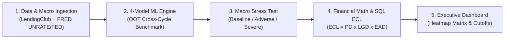

# Executive Business Summary & Credit Risk Glossary

---

## 1. The Core Business Problem

### Background & Industry Challenge
Consumer lending institutions (banks, fintech lenders, credit unions) originate billions of dollars in unsecured personal loans during economic expansions. Traditional credit underwriting scorecards evaluate borrowers based **solely on static micro-level credit attributes** (e.g., FICO score, income, debt-to-income ratio). 

### The Flaw of Traditional Scorecards (Through-the-Cycle / TTC):
* Traditional models assume the macroeconomic environment remains constant.
* When recessions occur (unemployment spikes) or the Federal Reserve raises interest rates (debt servicing burdens rise), borrower default rates increase dramatically.
* **Without macroeconomic sensitivity, lenders suffer massive unforecasted capital losses, liquidity crunches, and regulatory non-compliance under CECL (Current Expected Credit Losses) and IFRS 9 mandates.**

---

## 2. How the Problem Was Solved (The 5-Phase Framework)

### Step-by-Step Solution Breakdown:

1. **Phase 1: Ingestion & Macroeconomic Synchronization:**
   * Ingested **1,344,401** resolved LendingClub loans and synchronized monthly Federal Reserve macroeconomic indicators (**Unemployment Rate `UNRATE`** and **Federal Funds Rate `FEDFUNDS`**) via chronological `Year_Month` join keys.
2. **Phase 2: Point-in-Time (PiT) Machine Learning Engine:**
   * Trained a **4-Model Champion-Challenger Suite** (Logistic Regression, Random Forest, LightGBM, XGBoost) using **Temporal Out-of-Time (OOT)** validation (Train: 2007–2015, Test: 2016–2018) to eliminate lookahead bias.
   * **Champion Model:** **XGBoost (Hist Tree)** achieved the highest separation ($\text{AUC} = 0.6265, \text{KS} = 18.03\%$).
3. **Phase 3: Macroeconomic Stress Testing Engine:**
   * Subjected **517,807 active test portfolio loans** ($\$7.48\text{B}$ exposure) to 3 supervisory scenarios:
     * **Baseline:** Current prevailing macro rates.
     * **Adverse (+1.5% Unemployment, +0.5% Fed Rate):** Mild recession shock.
     * **Severe (+3.5% Unemployment, +1.5% Fed Rate):** Deep stagflationary recession shock.
4. **Phase 4: Financial Math & SQL Expected Credit Loss (ECL):**
   * Implemented regulatory accounting math: $\text{ECL} = \text{PD} \times \text{LGD} \times \text{EAD}$.
   * Quantified total expected portfolio loss: **$\$785.2\text{M}$ Baseline ECL** (10.49% loss rate).
   * Segmented loans into a **FICO $\times$ DTI Risk Concentration Matrix**.
5. **Phase 5: The Deliverable & Underwriting Risk Policy:**
   * Built an interactive **Streamlit & Power BI Executive Dashboard** with dynamic multi-dimensional slicers.
   * **Actionable Verdict for Risk Committee:**
     > *"Halt originations for unsecured loans where $\text{DTI} \ge 20\%$ and $\text{FICO} < 700$ to eliminate $\approx \$276.4\text{ Million}$ in high-risk default exposure and protect portfolio capital adequacy."*

---

## 3. Glossary of Financial & Credit Risk Terminology

| Term | Abbreviation | Clear Business & Mathematical Explanation |
| :--- | :---: | :--- |
| **Probability of Default** | **PD** | The likelihood (percentage between $0\%$ and $100\%$) that a borrower will fail to meet their contractual loan obligations over a given time horizon. |
| **Loss Given Default** | **LGD** | The economic percentage of the loan balance that the lender loses permanently if the borrower defaults (after accounting for recoveries and legal fees). In this project, $\text{LGD} = 50.0\%$. |
| **Exposure at Default** | **EAD** | The gross dollar amount of loan principal outstanding at the moment a borrower defaults ($\text{EAD} = \text{loan\_amnt}$). |
| **Expected Credit Loss** | **ECL** | The dollar value of expected financial loss in a credit portfolio: $$\text{ECL} = \text{PD} \times \text{LGD} \times \text{EAD}$$ |
| **Incremental Stress Gap** | **ECL Gap** | The additional dollar loss a lender would suffer in an economic recession compared to the baseline economy: $$\text{ECL Gap} = \text{ECL}_{\text{Severe}} - \text{ECL}_{\text{Base}}$$ |
| **Point-in-Time (PiT) Model** | **PiT** | A credit risk model that conditions default probabilities on both the borrower's attributes **and the prevailing macroeconomic environment** (Unemployment, Interest Rates). |
| **Through-the-Cycle (TTC) Model** | **TTC** | A traditional credit score that evaluates borrower risk based on long-term historical averages without adjusting for real-time economic shocks. |
| **Debt-to-Income Ratio** | **DTI** | A borrower's total monthly debt obligations divided by their gross monthly income. Higher DTI ($> 25\%$) indicates higher leverage and vulnerability to rate hikes. |
| **FICO Credit Score** | **FICO** | A 3-digit standardized credit score ($300 - 850$) measuring creditworthiness. Subprime is $< 660$, Fair is $660–699$, Prime is $\ge 700$. |
| **Charged Off** | — | A loan status where the lender writes off the debt as uncollectible and recognizes an accounting default loss ($\text{Target} = 1$). |
| **CECL / IFRS 9** | — | International accounting and banking regulations requiring financial institutions to provision expected lifetime credit losses upfront rather than waiting for incurred losses. |

---

## 4. Glossary of Machine Learning & Statistical Metrics

| Metric / Term | Mathematical Formula / Definition | Purpose in Credit Risk |
| :--- | :--- | :--- |
| **Out-of-Time (OOT) Validation** | Split chronologically: Train on older vintages ($2007–2015$), Test on future vintages ($2016–2018$). | Prevents lookahead data leakage and verifies if a model can accurately forecast future credit cycles. |
| **ROC-AUC** | Area Under the Receiver Operating Characteristic Curve ($0.50 - 1.00$). | Measures the model's ability to rank high-risk defaulting borrowers above safe paying borrowers. |
| **Gini Coefficient** | $$\text{Gini} = 2 \times \text{AUC} - 1$$ | Standard banking metric for scorecard discriminatory power. Ranges from $0$ (random) to $1$ (perfect separation). |
| **Kolmogorov-Smirnov (KS) Statistic** | $$\text{KS} = \max \|\text{TPR}(t) - \text{FPR}(t)\|$$ | Measures maximum vertical separation between the cumulative distribution of defaults vs. non-defaults. |
| **Log-Loss / Brier Score** | Mean squared difference between predicted default probability and actual outcome ($0$ or $1$). | Evaluates **probability calibration** (ensuring a predicted $20\%$ PD corresponds to an actual $20\%$ default rate). |
| **Histogram Tree Boosting (`tree_method='hist'`)** | Bins continuous features into discrete integer buckets ($256$ bins). | Reduces CPU memory and training time by $\approx 85\%$, allowing $1.34\text{M}$ loans to train in seconds on an Intel i3 CPU. |
